# Travel Companion (final project)

**Рябенко Данила Игоревич**
**Б9123-09.03.03ПИКД** (1 группа + 2 подгруппа)

Финальный проект — развитие приложения «Countries Explorer» из ДЗ 3–6 в персонализированный
offline-first mini-product **Travel Companion**. Базовый функционал (список стран, деталь, навигация,
Hilt + Retrofit + Room + Flow) сохранён. API из `apicountries.com` стал источником
*контента*, а центр приложения переехал в личный слой пользователя: дневник путешествий,
коллекции, заметки, история, профили и фоновое обновление кэша.

---

## 1. Что добавлено в финальной работе

| Слой | Что появилось |
|---|---|
| Сценарии | Travel Journal (visits + ratings + notes), Collections (M:N), Saved filters, History/Recent, локальные профили без серверной авторизации |
| Экраны | Bottom navigation 4 вкладок: **Countries / Journal / Collections / Settings**, плюс новые: **Recent** и **Collection detail** |
| Данные | 8 новых Room-таблиц + связь M:N с CASCADE; FK обеспечивает целостность |
| Offline-first | TTL-кэш стран, stale-while-revalidate в деталке, локальный фолбэк списка/поиска/фильтра региона при ошибке сети |
| Background | WorkManager: periodic refresh кэша, one-time warmup всех стран, weekly cleanup устаревших записей |
| Settings | Тема (system/light/dark), area unit (km²/mi²), TTL кэша, частота фонового sync, Sync now, Download all, управление профилями |
| Тесты | 35+ unit + integration на бизнес-логику / реактивную часть / offline-fallback |

---

## 2. Новые пользовательские данные (Room v8)

Все «личные» таблицы привязаны к `profileId` — каждый профиль хранит свои данные отдельно.

| Таблица | Назначение | PK |
|---|---|---|
| `profiles` | Локальные пользователи (без серверной авторизации) | `id` autoincrement |
| `visits` | Посещённые страны: дата + рейтинг 1..5 + заметка | (countryCode, profileId) |
| `wishlist` | Хочу посетить: приоритет 1..5 + дата | (countryCode, profileId) |
| `country_notes` | Личная заметка по стране | (countryCode, profileId) |
| `collections` | Свои списки стран (имя + цвет + порядок) | `id` autoincrement |
| `collection_items` | **M:N** связь страна ↔ коллекция; FK на collections с CASCADE | (collectionId, countryCode) |
| `recent_views` | История открытий деталок | (countryCode, profileId) |
| `saved_filters` | Сохранённые пресеты фильтра (region + favoritesOnly) | `id` autoincrement |
| `country_cache` | TTL-кэш JSON-снимков стран для offline-first | `countryCode` |
| `favorites` | Избранное (теперь привязано к профилю — обновлено через миграцию v7→v8) | (countryCode, profileId) |

Все эти таблицы создаются/изменяются **пользователем через UI**, влияют на поведение приложения
(visited-бейдж на карточках, фильтрация коллекций, статистика, реактивные обновления)
и не сводятся к одному toggle.

DataStore использован **только** для настроек (тема, единицы, TTL, частота refresh, activeProfileId,
показывать ли visited-бейдж) — никаких пользовательских данных в нём не хранится.

---

## 3. Новые пользовательские сценарии

### Сценарий 1 — Travel Journal (visits + rating + notes) ⭐
**Что делает пользователь:** открывает страну → жмёт «Mark visited» → выбирает дату, рейтинг 1–5
звёзд, пишет заметку → сохраняет. На карточке в списке появляется ✓-бейдж. В разделе **Journal →
Visited** видит все свои посещения с группировкой и статистикой («N стран в M регионах, средняя
оценка X.X»).

**Сквозь все слои:** UI (диалог) → ViewModel (Flow) → JournalRepository → VisitDao → Room.
Дедупликация на уровне composite PK — повторный visit апдейтит запись, а не плодит дубли.

### Сценарий 2 — Collections (M:N со своими списками) ⭐
**Что делает пользователь:** создаёт коллекцию «Coffee countries» с цветом → на деталке любой страны
жмёт «Add to collection» → multi-select-диалог. Одна страна может быть в нескольких коллекциях.
Удаление коллекции каскадом удаляет все её элементы через ForeignKey CASCADE.

Это даёт **новую связь между сущностями** — пункт ТЗ «1 сценарий приводит к новой сущности или связи».

### Сценарий 3 — Offline-first + WorkManager ⭐
**Что делает пользователь:** один раз открыл приложение онлайн → все 250 стран в кэше → выключил
интернет → приложение полностью работает: список, поиск, фильтр по региону, деталь любой страны.
Баннер «Cached — may be outdated» появляется если кэш старше TTL.

Подробнее в разделах 4–5.

### Сценарий 4 — Saved filters
**Что делает пользователь:** применил фильтр (например «Africa» или «Favourite») → жмёт «Save current»
→ даёт имя «My Africa view» → пресет появляется чипом. Тап по чипу мгновенно применяет фильтр.
Каждый пресет — отдельная запись в `saved_filters`, привязана к профилю.

### Сценарий 5 — Локальные профили (расширение из раздела 3 ТЗ)
**Что делает пользователь:** в шапке Countries-вкладки аватарка с инициалом → тап открывает picker →
можно создать новый профиль (имя + цвет), переключиться, переименовать, удалить. У каждого профиля
**свой Journal, Wishlist, Notes, Collections, Saved filters, Recent views, Favourites**. При смене
профиля **весь UI перестраивается автоматически** через `flatMapLatest` в репозиториях:

```kotlin
val visits: Flow<List<VisitEntity>> = profileRepository.activeProfile
    .flatMapLatest { p -> visitDao.observeByProfile(p.id) }
```

Активный профиль сохраняется в DataStore и восстанавливается после перезапуска. Удаление профиля
каскадом удаляет его данные.

### Дополнительно — Recent views (обязательный экран по ТЗ)
Каждое открытие деталки записывается в `recent_views` через `INSERT OR REPLACE` —
**автоматическая дедупликация на уровне БД** (повторный просмотр апдейтит timestamp,
не плодит строки). Отдельный экран Recent + лента «See all» с навигации.

---

## 4. Как устроена offline-first часть

**Принцип:** UI всегда читает из Room через Flow; сеть нужна только для обновления кэша.
Реализовано в [`CountriesRepository`](app/src/main/java/com/example/hm_third_count/data/repository/CountriesRepository.kt) +
[`CachePolicy`](app/src/main/java/com/example/hm_third_count/data/cache/CachePolicy.kt).

### Кэш стран
- Любой успешный запрос (`getAllCountries`, `getCountryByCode`, `searchCountries`,
  `getCountriesByRegion`) **пишет результат в `country_cache`** с timestamp.
- Открыл список → 250 стран попадают в кэш одним запросом → теперь деталь **любой** страны
  открывается без сети.

### Stale-while-revalidate на деталке
Реализовано в `CountryDetailViewModel`:
1. Прочитать запись из `country_cache`
2. Если есть и **свежая** (по TTL из настроек) → отдать UI, сеть не дёргать
3. Если есть и **протухла** → сразу отдать UI **+ параллельно** запустить fetch; на UI индикатор «Updating…»
4. Если кэша нет → Loading + fetch; ошибка только если сеть упала **и** кэша не было

`CachePolicy.strategy(cachedAt, now, ttlHours, forceRefresh)` возвращает один из трёх вариантов
(`FetchOnly` / `UseCacheOnly` / `UseCacheAndRevalidate`) — это чистая бизнес-логика, покрытая
unit-тестами.

### Локальный фолбэк списка
В `CountriesRepository.getAllCountries()`:
```kotlin
try {
    val countries = api.getAllCountries()
    writeToCache(countries)
    countries
} catch (e: Exception) {
    val cached = readAllFromCache()
    if (cached.isNotEmpty()) cached else throw e
}
```
Аналогично для `searchCountries` (локальный поиск по подстроке имени по кэшу) и
`getCountriesByRegion` (локальная фильтрация по региону).

### Результат
Без сети при наличии локальных данных приложение **остаётся полностью рабочим**:
- список стран показывается из кэша
- поиск работает (по кэшу)
- фильтр по регионам работает
- деталь любой ранее загруженной страны открывается
- Journal / Collections / Recent / Settings — работают всегда (данные локальные)

---

## 5. Где и зачем используется фоновая обработка (WorkManager)

Управляется через [`SyncCoordinator`](app/src/main/java/com/example/hm_third_count/sync/SyncCoordinator.kt) +
3 воркера с `@HiltWorker` (Hilt-WorkManager integration в `CountriesApp.workManagerConfiguration`).

### 1. `RefreshCacheWorker` — periodic
**Зачем:** обновляет кэш для «дорогих» пользователю стран — все visited, wishlist, в коллекциях.
Без него visited-страны морально устаревали бы между запусками.

**Расписание:** задаётся пользователем в Settings (off / 6h / 12h / 24h).
Constraint: `NetworkType.CONNECTED`.

### 2. `WarmupAllCountriesWorker` — one-time
**Зачем:** прогревает кэш всеми 250 странами для полноценного offline-first.
Запускается:
- автоматически при первом старте, если кэш пуст (через `SyncCoordinator.bootstrap()`)
- вручную из Settings → «Download all»

### 3. `CleanupStaleCacheWorker` — periodic (раз в 7 дней)
**Зачем:** не позволяет `country_cache` бесконечно расти. Удаляет записи **старше 14 дней**,
которые **не относятся** ни к одной из «пользовательских» сущностей (visited / wishlist / collections / recent).
Закреплённые пользователем страны остаются всегда.

### Видимость в UI
- На вкладке Countries — баннер «Updating in background…» когда воркер в `RUNNING`
  (через `SyncCoordinator.syncRunning` Flow).
- В Settings — «Last sync: X ago» (читается из DataStore) + кнопка «Sync now».

---

## 6. Какие тесты написаны

Все тесты — JVM unit + integration (без Android-эмулятора), запуск: `./gradlew testDebugUnitTest`.

| Файл | Кейсы | Категория |
|---|---|---|
| `CachePolicyTest` | 10 | Бизнес-логика |
| `JournalRepositoryTest` | 5 | Бизнес-логика / реактивная |
| `RecentViewsRepositoryTest` | 5 | Реактивная (flatMapLatest + дедупликация) |
| `CollectionsRepositoryTest` | 5 | Бизнес-логика (M:N membership diff) |
| `CountryDetailViewModelTest` | 4 | Экранная (stale-while-revalidate + retry) |
| `CountriesRepositoryOfflineTest` | 6 | Offline / sync (integration: Repo + Fake API + Fake Room) |

**Итого ~35 тестов**, все зелёные.

### Что покрыто

**На бизнес-логику** — `CachePolicy.isStale` граничные случаи (свежий/протухший/часы из будущего/нулевой TTL),
`CachePolicy.strategy` для каждой комбинации (нет кэша / свежий / протухший / forceRefresh),
clamping рейтинга 1..5 в `JournalRepository`, blank-note → delete.

**На реактивную логику** —
дедупликация `recordView` (5 повторов = 1 запись с обновлённым timestamp),
`flatMapLatest` переключение профиля → Flow перестраивается,
`setCountryMembership` корректно делает diff add/remove (нетривиальный сценарий),
stale-while-revalidate на деталке (свежий → не дёргает сеть; протух → дёргает + показывает кэш).

**На offline / sync / background** —
успешный запрос прогревает кэш всех стран,
fallback на кэш при сетевой ошибке,
Failure только когда нет ни сети ни кэша,
локальный поиск по кэшу при ошибке сети,
фильтр по региону работает офлайн,
favorites привязан к активному профилю.

Инфраструктура тестов:
- `MainDispatcherRule` — подмена `Dispatchers.Main` на `UnconfinedTestDispatcher`
- `TestClock` — управляемое время для TTL
- `FakeDao*`, `FakeCountriesApi` — in-memory фейки с реальной семантикой PRIMARY KEY / REPLACE
- MockK для верификации сетевых вызовов

---

## API

[ApiCountries.com](https://apicountries.com/) — без API-ключей, без HTTP 400, 195+ стран.
Используется для получения данных стран; вся «личная» часть приложения от API не зависит.

## Запуск

1. Открыть в Android Studio (Iguana и новее)
2. Sync Gradle
3. ▶ Run на эмулятор / телефон с Android 7.0+ (minSdk 24)

При первом старте автоматически создаётся профиль **Default** и запускается warmup кэша.

Если плохо подгружаются данные — попробуй включить VPN (с российским провайдером
apicountries.com иногда блокируется).

---

## Скриншоты

### Главные экраны

| Список стран | Деталь страны | Journal |
|---|---|---|
| 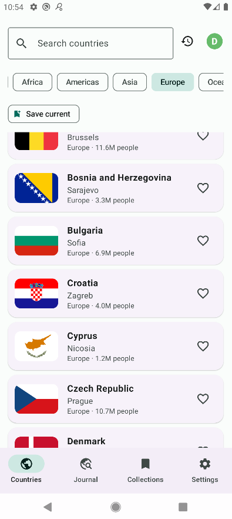 | 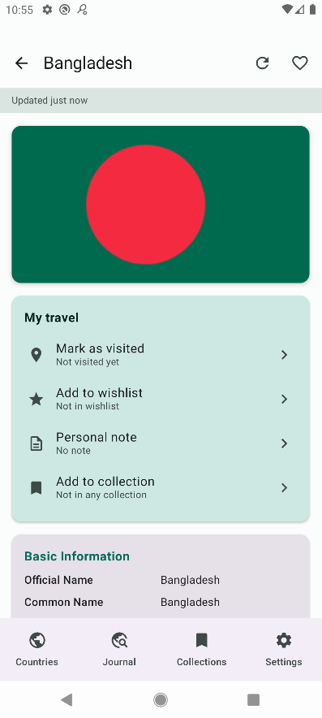 | 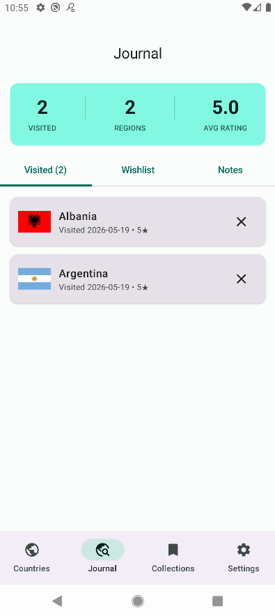 |

| Collections | Содержимое коллекции | Recent |
|---|---|---|
| 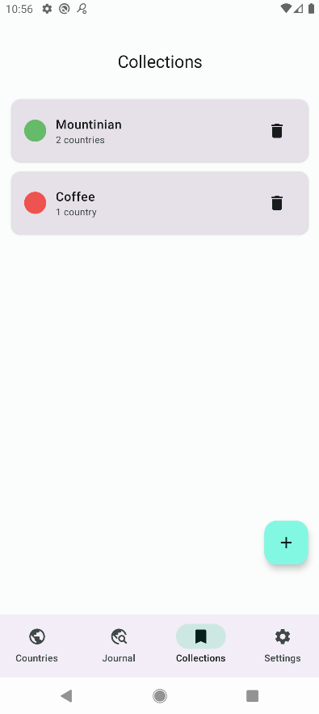 | 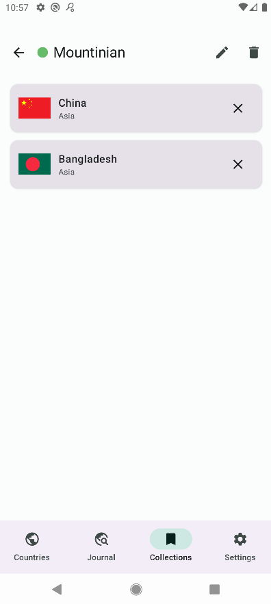 | 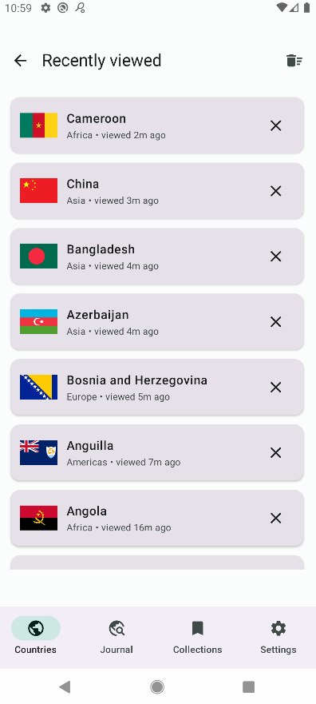 |

| Settings | Управление профилями |
|---|---|
| 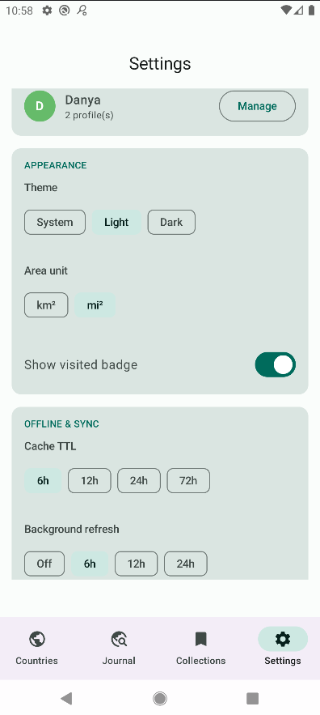 | 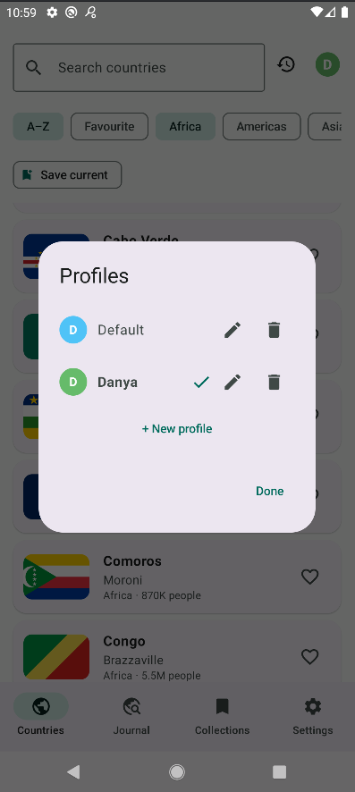 |

### Диалоги Travel Journal

| Mark as visited | Add to wishlist | Personal note |
|---|---|---|
| 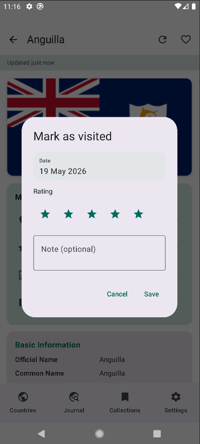 | 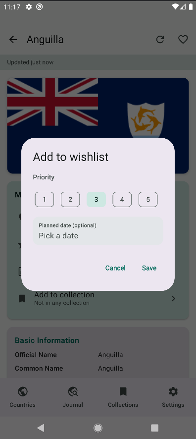 | 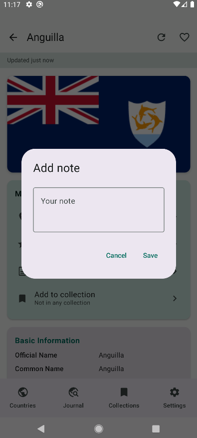 |

### Состояния

| Favourite фильтр | Offline (stale-кэш) | Empty / Not found |
|---|---|---|
| 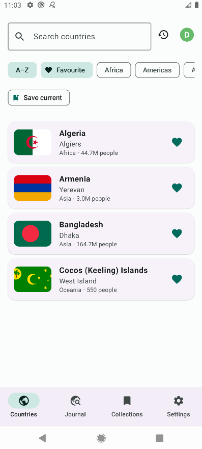 | 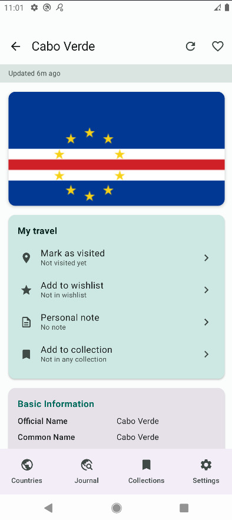 | 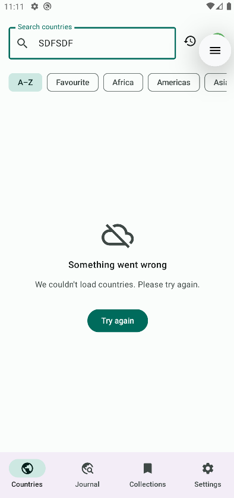 |

---

## Чек-лист соответствия ТЗ финального проекта

- ✅ Базовый проект остаётся узнаваемым и рабочим (список / деталь / навигация / Retrofit / Room / Flow)
- ✅ Личная часть приложения с собственными данными и сценариями
- ✅ Экран настроек
- ✅ Экран истории / recent
- ✅ ≥3 законченных сценария (реализовано 5: Journal, Collections, Offline-first, Saved filters, Profiles)
- ✅ ≥2 существенных сценария (Journal, Collections, Offline-first)
- ✅ ≥1 сценарий с новой сущностью / связью (`visits`, `collection_items` M:N)
- ✅ DataStore только для настроек
- ✅ Room для пользовательских данных + связей
- ✅ Offline-first: доступ без сети, локальные данные в UI, сеть только для обновления
- ✅ WorkManager обслуживает offline-first (3 связанных воркера)
- ✅ Тесты на бизнес-логику, реактивную часть, offline/sync/background
- ✅ Локальные профили (допустимое расширение из раздела 3 ТЗ)
